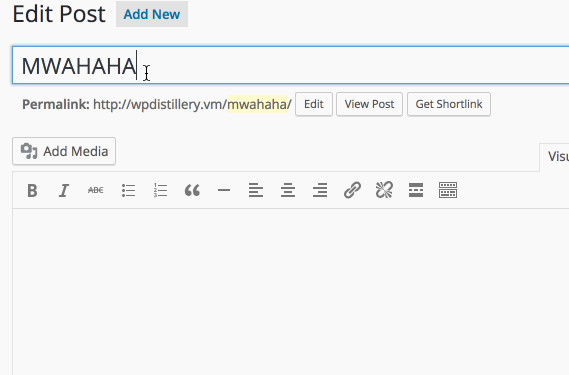
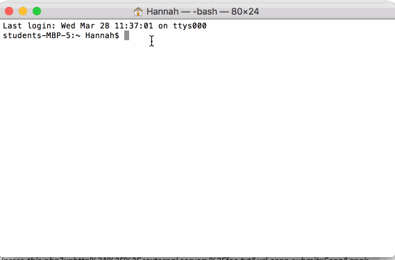

# Project 7 - WordPress Pentesting

Time spent: 4 hours spent in total

> Objective: Find, analyze, recreate, and document three vulnerabilities affecting an old version of WordPress

## Pentesting Report

1.   Authenticated Cross-Site Scripting (XSS) via Media File Metadata
  - [ ] Summary: If the WordPress user is an Editor or Admin, then they have a tag, unfiltered_html associated with them. Due to this, meta data within audio files such as MP3s are not sanitized correctly when in Admin or Editor mode. Thus, since this file is plugged in to wp_playlist_shortcode() and rendertracks() and these do no encode output, one can implement a XSS attack here.
    - Vulnerability types: Two XSS vulnerabilities, and sanitizing vulnerability
    - Tested in version: 4.2
    - Fixed in version: 4.2.13
  - [ ] GIF Walkthrough: 
  - [ ] Steps to recreate:
	1. Upload a malicious MP3 file (here, xss.mp3) to the Media Library.
	2. Place the malicious MP3 in a post via an Audio Playlist. 
	3. Watch the cookie pop-up appear.
  - [ ] Affected source code:
    - [Link 1](https://github.com/WordPress/WordPress/commit/28f838ca3ee205b6f39cd2bf23eb4e5f52796bd7)

2.  Authenticated Stored Cross-Site Scripting (XSS) in YouTube URL Embeds
  - [ ] Summary: While WordPress does a fairly decent job cleansing input data for XSS attacks, for example, turning alert(1) into text, there is a vulnerability still present in using the embed shortcode. The YouTube embedding was of most interest for an attack due to its vulnerability to embed script into the URL. While this text is also cleansed, the functions it is cleansed through are vulnerable to the use of escape sequences (here \x3c was used for <). Thus, in employing escape sequences in conjunction with XSS in a YouTube URL Embed, one is able to create and alert(1) style pop-up.
    - Vulnerability types: Cross-Site Scripting (XSS) via escape sequence usage
    - Tested in version: 4.2
    - Fixed in version: 4.2.13
  - [ ] GIF Walkthrough: 
  - [ ] Steps to recreate:
	1. Create a new post in WordPress.
	2. Use the embed language, YouTube URL, and escape sequences as follows: 
	[embed src='https://youtube.com/embed/12345\x3csvg onload=alert(1)\x3e'][/embed]
  - [ ] Affected source code:
    - [Link 1](https://github.com/WordPress/WordPress/commit/419c8d97ce8df7d5004ee0b566bc5e095f0a6ca8)

3.  Press This CSRF DoS
  - [ ] Summary: The "Press This" function in WordPress allows user to give a URL that it will scan for content, such as images, etc. The issue lies in the fact that it does not set a threshold for how large the data can be that "Press This" will retrieve. Thus, if one implements a very large file for "Press This" all of the CPU resources will be allocated to it, creating a Denial of Service.
    - Vulnerability types: Denial of Service, due to no max input bound
    - Tested in version: 4.2
    - Fixed in version: 4.2.13
  - [ ] GIF Walkthrough: 
  - [ ] Steps to recreate: 
	1. Make a very large text file on external server in image form.
	2. Create a .html file with many GET entries for the "Press This" plug-in, in 		order to create a denial of service within WordPress. (example text: )
  - [ ] Affected source code:
    - [Link 1](https://github.com/WordPress/WordPress/commit/263831a72d08556bc2f3a328673d95301a152829)

## Assets

-[malicious MP3 file] (https://www.securify.nl/advisory/SFY20160742/xss.mp3)

## Resources

- [WordPress Source Browser](https://core.trac.wordpress.org/browser/)
- [WordPress Developer Reference](https://developer.wordpress.org/reference/)
- [Media File XSS Reference](http://seclists.org/oss-sec/2017/q1/563)
- [Press This Exploit Reference](https://sumofpwn.nl/advisory/2016/cross_site_request_forgery_in_wordpress_press_this_function_allows_dos.html)
- [XSS with YouTube Link Reference](https://blog.sucuri.net/2017/03/stored-xss-in-wordpress-core.html)

GIFs created with [LiceCap](http://www.cockos.com/licecap/).

## Notes

-The DOS attack presented a challenge of determining server IDs for the GET posts. Additionally, transferring the dos.html to WordPress was an initial obstacle.
-General set-up challenges included, initially not being able to properly view posts, and general difficulty in navigating WordPress.

## License

    Licensed under the Apache License, Version 2.0 (the "License");
    you may not use this file except in compliance with the License.
    You may obtain a copy of the License at

        http://www.apache.org/licenses/LICENSE-2.0

    Unless required by applicable law or agreed to in writing, software
    distributed under the License is distributed on an "AS IS" BASIS,
    WITHOUT WARRANTIES OR CONDITIONS OF ANY KIND, either express or implied.
    See the License for the specific language governing permissions and
    limitations under the License.